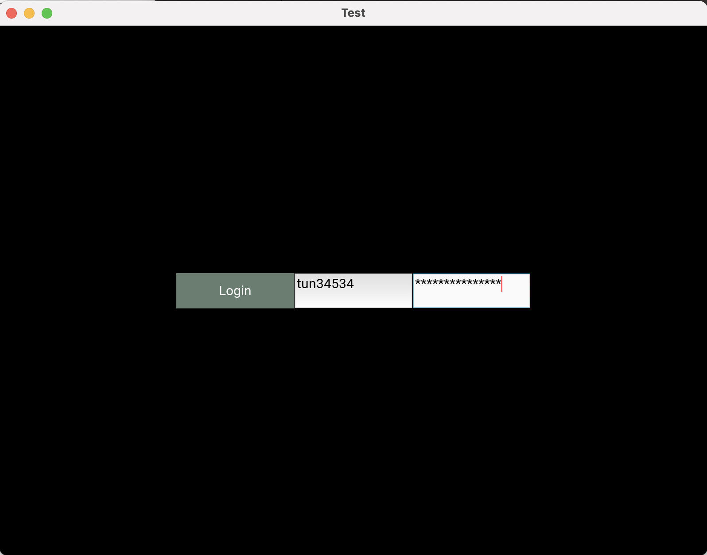
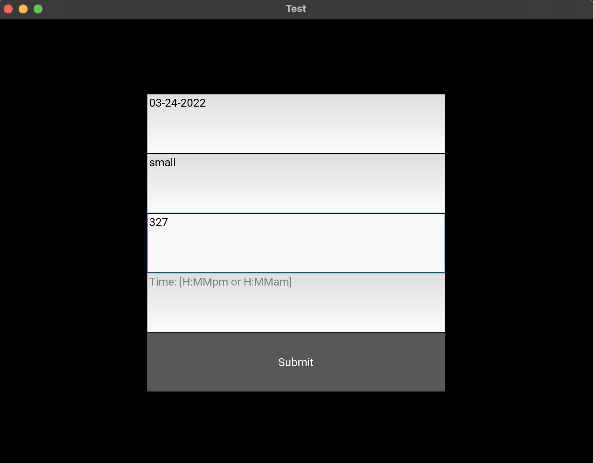

# Library Room Auto-Scheduler

For Temple students who need to schedule rooms in Charles Library farther in advance, the Library Room Auto-Scheduler is a room booking app that allows you to automatically schedule rooms as soon as they’re available. Unlike Charles’s own scheduler, our product allows proactive students to book rooms more than 2-3 days in advance without needing to navigate through the library’s appointment interface.




# How to run

## Prerequisites

- You'll need a [Github account](https://github.com/) and a [private repository](https://docs.github.com/en/get-started/quickstart/create-a-repo) to save booking information in. _Note: your Temple username and password will be stored here for the scheduler to remotely access your account, so MAKE SURE the repo is private!_

## For MacOS users :

- Download the latest zip from the Release section on the right on GitHub.
- Extract the bookRoom.dmg file from the zip and open it
- Right click on the bookRoom.app file inside and click 'Open'. A popup will be appear claiming the file is not safe.
- Repeat the previous step. This time, the popup should have the option 'Open'. Click it and the application should load.

## For Windows/Linux users :

- Clone the repository (using git clone command)
- Make sure python 3.6+ is installed and can be run from the command line
- Navigate to the location your cloned repo is (use the cd command)
- Install the dependencies by executing `pip install -r requirements.txt` from the main directory
- Navigate to the proofOC folder (use the cd command)
- Run the bookRoom.py script by typing "python bookRoom.py" into the command line
- The application should load

# How to contribute

Follow the [project board](https://github.com/cis3296s22/libraryroomscheduler/projects/2) to know the latest status of the project.

## How to build

_Note: Visual Studio Code is the recommended editor for the Library Room Auto-Scheduler_

- Python 3.8 or higher is recommended to contribute
- Clone this repo
- (Recommended) Create a virtual environment
  - In the main folder of this project, execute `python -m venv venv` on the command line (`python3` if you have 2.x installed as well) to create the virtual environment
  - Activate it!
    - Mac/Linux: `source ./venv/bin/activate`
      - \*_note: csh and fish shell users use_ `activate.csh` _and_ `activate.fish` _respectively_\*
    - Windows: `.\venv\Scripts\activate`
- Install the dependencies by executing `pip install -r requirements.txt` from the main directory

If you used a virtual environment, be sure to deactivate it by executing `deactivate` from the root of this project once you are finished.

---

`main.py` will login and book a room through the command line

`bookRoom.py` to login and book a room with a GUI

---

In both programs, the user will be prompted for their TU credentials to login and they'll be asked to specify the details of their booking.

- main.py opens the browser to show the automation of the login/booking process, but it won't make the reservation.

- bookRoom.py the user can interact with a GUI to login and input their booking details and clone URL for the remote repository. The reservation details will be saved the a csv file in the remote repository.

---

### BUILD EXECUTABLE

- From exe folder:

```
pyinstaller --onefile -y --clean --windowed bookroom.spec
pushd dist
hdiutil create ./bookRoom.dmg -srcfolder bookRoom.app -ov
popd
```

<!-- CREATE THE EXE FOLDER CONTENTS -->
<!-- pyinstaller --onefile -y --clean --windowed --name bookRoom --exclude-module _tkinter --exclude-module Tkinter --exclude-module enchant --exclude-module twisted ../proofOC/bookRoom.py -->
<!-- Change line 23 of bookroom.spec so it looks like : exe = EXE(pyz, Tree('../proofOC/'), -->
